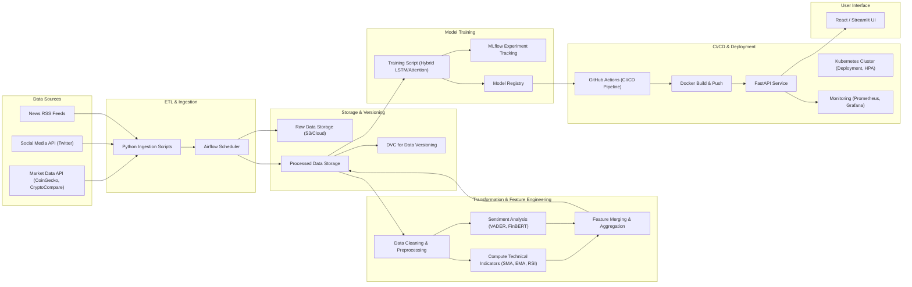

# System Architecture for BitPredict

This document describes the end-to-end system architecture for BitPredict—an industry-grade Bitcoin price prediction product. The architecture covers all layers from data ingestion through model training, CI/CD automation, deployment, monitoring, and the user interface. It is designed for scalability, reproducibility, and robustness to support production-level operations.

---

## Table of Contents
1. [Overview](#overview)
2. [Data Sources](#data-sources)
3. [ETL Pipeline](#etl-pipeline)
   - [Data Ingestion](#data-ingestion)
   - [Data Storage & Versioning](#data-storage--versioning)
   - [Data Transformation & Feature Engineering](#data-transformation--feature-engineering)
4. [Model Training & Experiment Tracking](#model-training--experiment-tracking)
5. [CI/CD Pipeline](#cicd-pipeline)
6. [Deployment & Monitoring](#deployment--monitoring)
7. [User Interface](#user-interface)
8. [Summary Diagram](#summary-diagram)
9. [References & Resources](#references--resources)

---

## Overview

BitPredict integrates multiple data sources—market data APIs, social media sentiment, and news feeds—to create a comprehensive dataset for Bitcoin price prediction. This dataset is preprocessed and enriched with technical indicators (e.g., SMA, EMA, RSI) and sentiment scores (using VADER and FinBERT). A hybrid deep learning model (such as an LSTM with attention mechanisms) is trained and tracked using MLflow. The trained model is deployed via a FastAPI backend in a Docker container and orchestrated on a Kubernetes cluster. CI/CD pipelines automate the entire process, while monitoring with Prometheus and Grafana ensures system reliability. A user-friendly frontend (React or Streamlit) enables real-time predictions and insights.

---

## Data Sources

- **Market Data:**  
  - *Sources:* CoinGecko, CryptoCompare  
  - *Data:* Historical and live OHLC (Open, High, Low, Close) prices, trading volumes

- **Sentiment Data:**  
  - *Social Media:* Twitter data (collected via Tweepy)  
  - *News:* Headlines and articles from RSS feeds (using Feedparser)

These diverse data sources allow BitPredict to incorporate both quantitative and qualitative signals into the model.

---

## ETL Pipeline

### Data Ingestion

- **Ingestion Scripts:**  
  Custom Python scripts fetch data from the market APIs, Twitter, and RSS feeds.
  
- **Orchestration:**  
  Apache Airflow schedules and orchestrates these scripts via DAGs (e.g., `dags/bitcoin_pipeline.py`) to run at regular intervals.

### Data Storage & Versioning

- **Raw Data Storage:**  
  Raw files are stored in the `data/raw/` folder (and can be pushed to cloud storage like AWS S3).
  
- **Versioning:**  
  DVC (Data Version Control) tracks raw and processed data to ensure reproducibility.

### Data Transformation & Feature Engineering

- **Data Cleaning:**  
  Cleaning functions in `model/utils/etl.py` handle missing values, type conversions, and outlier removal.
  
- **Technical Indicators:**  
  Functions in `model/utils/features.py` compute indicators such as SMA, EMA, and RSI.
  
- **Sentiment Analysis:**  
  Sentiment processing is performed using VADER (for short texts) and FinBERT (for nuanced analysis), implemented in `model/utils/sentiment.py`.
  
- **Feature Merging:**  
  The cleaned price data, technical indicators, and sentiment scores are merged to create the final dataset (`data/processed/bitcoin_features.csv`).

---

## Model Training & Experiment Tracking

- **Model Training:**  
  The training script (`model/train.py`) loads the processed dataset, prepares time-series sequences, and trains a hybrid model (e.g., LSTM with attention) defined in `model/model.py`.
  
- **Experiment Tracking:**  
  MLflow is integrated to log hyperparameters, metrics, and model artifacts, ensuring reproducibility and enabling a model registry.

- **Notebooks:**  
  Jupyter notebooks in `model/notebooks/` support exploratory data analysis and prototyping.

---

## CI/CD Pipeline

- **Automation:**  
  GitHub Actions workflows (located in `.github/workflows/`) automate tests, model retraining, and Docker image builds on every commit.
  
- **Containerization:**  
  A Dockerfile in the `api/` directory containerizes the FastAPI backend.
  
- **Integration:**  
  The CI/CD pipeline ensures that changes in data or code trigger a full retraining and deployment cycle.

---

## Deployment & Monitoring

- **Deployment:**  
  The API service is deployed on a Kubernetes cluster using manifests stored in the `deployment/kubernetes/` folder. Key components include:
  - **Deployment** for managing pod replicas
  - **Service** for internal communication
  - **Ingress** for external access
  - **HPA (Horizontal Pod Autoscaler)** for scalability
  
- **Monitoring & Logging:**  
  Prometheus and Grafana provide real-time monitoring, while centralized logging (Fluentd/ELK) captures system logs. An alerting system feeds performance data back into the CI/CD pipeline.

---

## User Interface

- **Frontend:**  
  A user interface, built with React or Streamlit, allows users to interact with the prediction API, view real-time predictions, and monitor system metrics.

- **Integration:**  
  The UI communicates with the FastAPI backend via RESTful API calls, providing a seamless user experience.

---

## Summary Diagram

Below is a high-level architecture diagram summarizing the system:

---

## References & Resources

- **Data Ingestion & ETL:**  
  - [CoinGecko API Documentation](https://www.coingecko.com/en/api)  
  - [Tweepy Documentation](https://docs.tweepy.org/en/stable/)  
  - [Feedparser Documentation](https://pythonhosted.org/feedparser/)

- **Pipeline Orchestration:**  
  - [Apache Airflow Documentation](https://airflow.apache.org/docs/apache-airflow/stable/index.html)

- **Data Versioning:**  
  - [DVC Documentation](https://dvc.org/doc)

- **Model Training & Experiment Tracking:**  
  - [MLflow Documentation](https://mlflow.org/docs/latest/index.html)
  - [TensorFlow & Keras Documentation](https://www.tensorflow.org/guide/keras)

- **CI/CD & Deployment:**  
  - [GitHub Actions Documentation](https://docs.github.com/en/actions)
  - [Docker Documentation](https://docs.docker.com/get-started/)
  - [Kubernetes Documentation](https://kubernetes.io/docs/home/)
  - [Prometheus Documentation](https://prometheus.io/docs/introduction/overview/)
  - [Grafana Documentation](https://grafana.com/docs/)

---

This document provides a detailed, low-level view of the entire system architecture, from data sources and ETL processes to model training, CI/CD, deployment, and the user interface. Use this as your reference guide as you build and integrate each component of BitPredict.
